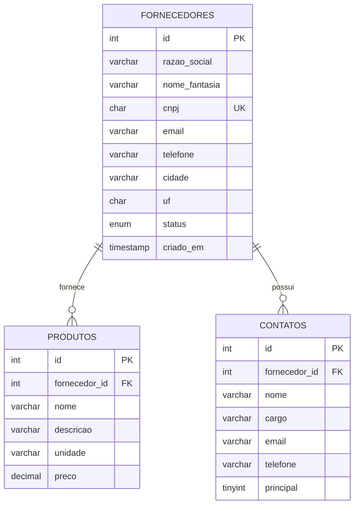

# Gerenciador de Fornecedores

Sistema web para cadastrar empresas fornecedoras, com **CNPJ**, **produtos fornecidos** e **contatos responsáveis**. Desenvolvido como trabalho de curso, com foco em uma estrutura simples, código organizado e interface limpa.


## Funcionalidades

- **Fornecedores**: cadastrar, listar, editar e excluir empresas (razão social, nome, CNPJ, e-mail, telefone, cidade/UF e situação ativo/inativo).
- **Produtos associados**: cada fornecedor possui uma lista de produtos com descrição, unidade e preço.
- **Contatos responsáveis**: cada fornecedor possui contatos com cargo, e-mail e telefone, podendo marcar um deles como principal.
- **Busca e filtro**: pesquisa por razão social, nome ou CNPJ (com ou sem pontuação) e filtro por situação.
- **Painel inicial**: totais de fornecedores, ativos, produtos e contatos, e os últimos cadastros.
- **CNPJ**: máscara automática, exige 14 dígitos (no navegador e no servidor) e não permite CNPJ duplicado. Os dígitos verificadores não são conferidos, então CNPJs fictícios são aceitos.

## Tecnologias

| Camada         | Tecnologia                                                   |
| -------------- | ------------------------------------------------------------ |
| Back-end       | PHP 7.4+ com PDO (consultas preparadas)                      |
| Banco de dados | MySQL / MariaDB                                              |
| Front-end      | HTML5, CSS3, Bootstrap 5.3 e Bootstrap Icons (via CDN)       |
| Interatividade | JavaScript puro (máscaras, validação, modais e abas)         |

## Modelo de dados

Um fornecedor pode ter vários produtos e vários contatos. Ao excluir um fornecedor, seus produtos e contatos são removidos junto (`ON DELETE CASCADE`).



O script completo está em [`database/schema.sql`](database/schema.sql) e já inclui alguns dados de exemplo.

## Estrutura do projeto

```
gerenciador-fornecedores/
├── actions/                  # Processam os formulários (POST) e redirecionam
│   ├── fornecedor_salvar.php
│   ├── fornecedor_excluir.php
│   ├── produto_salvar.php
│   ├── produto_excluir.php
│   ├── contato_salvar.php
│   └── contato_excluir.php
├── assets/
│   ├── css/style.css         # Estilos sobre o Bootstrap
│   └── js/app.js             # Máscaras, validação de CNPJ, modais e abas
├── config/
│   └── database.php          # Conexão PDO com o MySQL
├── database/
│   └── schema.sql            # Criação do banco, tabelas e dados de exemplo
├── includes/
│   ├── functions.php         # Funções auxiliares (CSRF, validação, formatação)
│   ├── header.php            # Topo e menu
│   ├── footer.php            # Rodapé e scripts
│   └── modal_excluir.php     # Modal de confirmação reutilizável
├── index.php                 # Painel inicial
├── fornecedores.php          # Listagem com busca e filtro
├── fornecedor_form.php       # Cadastro e edição de fornecedor
└── fornecedor_detalhe.php    # Dados do fornecedor, produtos e contatos
```

## Como executar

### Pré-requisitos

- PHP 7.4 ou superior, com a extensão `pdo_mysql` (já vem ativa no XAMPP, WAMP e Laragon)
- MySQL 5.7+ ou MariaDB 10.3+

### Passo a passo (XAMPP)

1. **Clone o repositório** dentro da pasta `htdocs` do XAMPP:

   ```bash
   git clone https://github.com/SEU-USUARIO/gerenciador-fornecedores.git
   ```

2. **Inicie o Apache e o MySQL** pelo painel do XAMPP.

3. **Importe o banco de dados**. No phpMyAdmin, abra a aba *Importar* e selecione `database/schema.sql`. Ou pelo terminal:

   ```bash
   mysql -u root -p < database/schema.sql
   ```

   > O script recria as tabelas do zero. Se importar novamente, os dados cadastrados serão substituídos pelos dados de exemplo.

4. **Confira a conexão** em `config/database.php`. Os valores padrão são os do XAMPP (`root`, sem senha). Se o seu MySQL for diferente, altere o arquivo ou defina as variáveis de ambiente `DB_HOST`, `DB_NAME`, `DB_USER` e `DB_PASS`.

5. **Acesse** no navegador: <http://localhost/gerenciador-fornecedores/>

### Alternativa: servidor embutido do PHP

Com o MySQL já rodando e o schema importado, execute na pasta do projeto:

```bash
php -S localhost:8000
```

E acesse <http://localhost:8000>.

## Regras e validações

- **Fornecedor**: todos os campos são obrigatórios (razão social, nome, CNPJ, e-mail, telefone, cidade, UF e situação). O CNPJ precisa ter 14 dígitos e ser único.
- E-mails são validados com `filter_var`; telefones aceitam DDD + 8 ou 9 dígitos.
- **Produto**: nome, unidade e preço são obrigatórios; só a descrição é opcional. O preço aceita `1.234,56` ou `12.5`.
- **Contato**: só o nome é obrigatório.
- Só pode haver **um contato principal** por fornecedor: ao marcar outro, o anterior deixa de ser principal.
- CNPJ e telefone são armazenados apenas com dígitos e formatados na exibição.

## Boas práticas aplicadas

- Consultas com **PDO e prepared statements** (proteção contra SQL Injection).
- Saída escapada com `htmlspecialchars` (proteção contra XSS).
- **Token CSRF** em todos os formulários que alteram dados; exclusões só via `POST`.
- Integridade garantida por chaves estrangeiras e restrição `UNIQUE` no CNPJ.
- Padrão *Post/Redirect/Get* com mensagens de retorno (o formulário não é reenviado ao atualizar a página).
- Layout responsivo, com foco visível no teclado e rótulos acessíveis.

## Possíveis melhorias

- Paginação da listagem e ordenação por coluna
- Autenticação de usuários e níveis de permissão
- Validação dos dígitos verificadores do CNPJ e suporte ao novo CNPJ alfanumérico (em vigor a partir de 2026)
- Consulta automática de dados do CNPJ por API
- Exportação da lista de fornecedores para CSV/PDF
- Histórico de compras e avaliação de fornecedores

## Autor

Desenvolvido por Lucas Braga como trabalho do curso de Desenvolvimento de Sistemas para a matéria de PW2.
